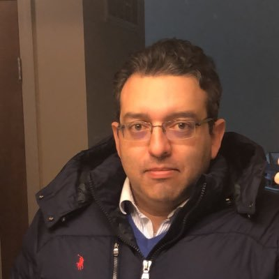

# Teaching Assistants

Most of this year's stellar group of teaching assistants have taken the course in the past, and they enjoyed it enough to come back for more. They are volunteering their precious time and energy to help make the course happen, and we couldn't be more delighted to welcome you to the course. All office hours and all teaching assistant work will be done remotely.

There is a lot to learn in this class. Don't suffer in silence - talk to us! As mentioned earlier, **you shouldn't spend more than 15 minutes struggling with anything in this class without asking for help.**

Visit the [Getting Help with 432][Getting Help with 432] section of this Syllabus for more details.

The Spring 2022 Teaching Assistants for 432 are:

- [Stephanie Merlino Barr][Stephanie Merlino Barr], PhD student in Clinical Translational Science
- [Wyatt Bensken][Wyatt Bensken], PhD student in Epidemiology \& Biostatistics
- [Ali Elsharkawi][Ali Elsharkawi], MS student in Clinical Research
- [Shiying Liu][Shiying Liu], PhD student in Epidemiology \& Biostatistics
- [Marie Michenkova][Marie Michenkova], MS student in Biomedical Health Informatics
- [Julia Yang Payne][Julia Yang Payne], PhD student in Clinical \& Translational Science
- [Monika Strah][Monika Strah], MS student in Epidemiology \& Biostatistics
- [Yanning Wu][Yanning Wu], PhD student in Epidemiology \& Biostatistics

## Getting To Know The TAs

#### Stephanie Merlino Barr {-}

```{r Stephanie_fig, echo = FALSE, out.width = '20%'}
knitr::include_graphics("images/Stephanie_Merlino_Barr.jpg")
```

Stephanie Merlino Barr is a fourth year PhD student in the Clinical Translational Science program and a full-time dietitian in the Neonatal Intensive Care Unit (NICU) at MetroHealth Medical Center; she is excited to be back TAing 431/432 for a second year! Stephanie's research focuses on the relationship of early life nutrition interventions and long-term growth and developmental outcomes in very low birthweight infants. Outside of work & PhD life, Stephanie is training for her first marathon and attempting to garden.

#### Wyatt Bensken {-}

```{r Wyatt_fig, echo = FALSE, out.width = '20%'}
knitr::include_graphics("images/Wyatt_Bensken.jpg")
```

Wyatt Bensken is a PhD Candidate in epidemiology and biostatistics in PQHS. Wyatt received his bachelors of science in public health from American University in Washington, DC, after which he worked as a research fellow at the National Institutes of Health in Bethesda, Maryland before joining the PhD program in 2018. Wyatt took 431 and 432 in 2018/2019, as well as 500 in 2020. He has been a volunteer TA for both 431 and 500. His research includes health services and population health research to identify disparities in health and health outcomes. Wyatt's dissertation focuses on health disparities for people with epilepsy, and is funded by the National Institutes of Health with a predoctoral fellowship. 

#### Ali Elsharkawi {-}

```{r Ali_fig, echo = FALSE, out.width = '20%'}

```

Ali Elsharkawi is in his second year in the M.S program in Clinical Research. He completed his bachelor's in Medicine, residency and fellowship in Electrophysiology. For his research interest, he studied the outcome of atrial fibrillation ablation procedures. Ali took 431 and 432 this past year and he is applying the skills he learned in his research projects. Ali enjoys spending time with his family, playing music, watching soccer, and traveling.

#### Shiying Liu {-}

```{r Shiying_fig, echo = FALSE, out.width = '20%'}
knitr::include_graphics("images/Shiying_Liu.jpg")
```

Shiying Liu is a third-year Ph.D. student in epidemiology and biostatistics in PQHS. Shiying completed her undergraduate study focusing on biological sciences at Fudan University back in China and then received her master's degree in biomedical engineering from Carnegie Mellon University. She took 431/432 in 2019/2020, which was of great help for her research projects and the preparations for the comprehensive exam. Currently, her research focus broadly addresses the critical gaps in knowledge of how information is encoded into DNA and how the story, when changed, leads to human disease using emerging statistical and bioinformatic approaches. Outside of research, she is a foodie and a superfan of detective fiction. Always passionate to solve the puzzle, "the truth is always curious and beautiful to seekers after it."

#### Marie Michenkova {-}

```{r Marie_fig, echo = FALSE, out.width = '20%'}
knitr::include_graphics("images/Marie_Michenkova.jpg")
```

Marie Michenkova is a Master's student in the Biomedical and Health Informatics program in the PQHS department. She is also a researcher in the Physiology and Biophysics department, where she studies acid-base physiology of the kidney and brain. Marie is from the Czech republic and came to the US seven years ago. She got her BS in Neuroscience from the University of Alabama at Birmingham in 2019 and moved to Cleveland the same year (and enjoys Ohio much more). Marie took PQHS 431 and 432 during the pandemic, in the Fall 2020 and Spring 2021, respectively. She has used what she learned in class (and not just the material itself) in her work and also in her free time, and enjoys it very much. She also likes roller skating, scuba diving, reading nordic literature and lock-picking to increase dexterity (legal affairs only). If you have any spare padlocks, send them her way!

#### Julia Yang Payne {-}

```{r Julia_fig, echo = FALSE, out.width = '20%'}
knitr::include_graphics("images/Julia_Payne.jpg")
```

Julia Yang Payne is a third year PhD student in the Clinical Translational Science program and a research assistant at the Center for Valued Based Care in the Cleveland Clinic. Julia's current research focuses on nonalcoholic fatty liver disease (NAFLD.) She's in the process of completing a meta-analysis and systematic review on the prevalence of NAFLD progression using skills she learned in 431 and 432. Besides school and work, she enjoys traveling, hiking, and going home to NYC whenever she can.

#### Monika Strah {-}

```{r Monika_fig, echo = FALSE, out.width = '20%'}
knitr::include_graphics("images/Monika_Strah.jpg")
```

Monika Strah is a second year student in the MS Biostatistics program. Monika's undergraduate degree is in Mathematics. Her research includes mathematical approaches to questions in population genetics and human evolution. Monika completed 431 and 432 in 2020/21 as well as 450 and 490. 

#### Yanning Wu {-}

```{r Yanning_fig, echo = FALSE, out.width = '20%'}

```

Yanning Wu is a first year PhD student in the Epidemiology/Biostatistics program. She received her M.S degree in Biostatistics from Brown University in May 2021. She did lots of cancer research in her masters program, especially lung cancer. Her current interests are in epigenetic research. In her spare time, she likes K-pop, hiking and swimming.


## TA office hours

TA office hours will begin on Wednesday 2022-01-19 and continue through Sunday 2022-04-24, other than during Spring Break. Zoom information to join these sessions will be found on [Canvas](https::/canvas.case.edu), and on our Shared Google Drive.

The weekly schedule of TA office hours follows:

Date | Time(s)
-----: | :---------
Sunday | 9:30 - 10:30 AM, 5:30 - 7:00 PM, 8:30 - 10:00 PM
Monday | 5:00 - 6:30 PM, 7:00 - 8:30 PM
Wednesday | Noon - 1:30 PM
Thursday | 6:00 - 7:30 PM
Friday | Noon - 1:00 PM
Saturday | 10:30 AM - Noon, 3:30 - 5:00 PM

Remember that [Piazza](https://piazza.com/case/spring2022/pqhs432) is available 24 hours a day, 7 days a week for your questions and answers.

